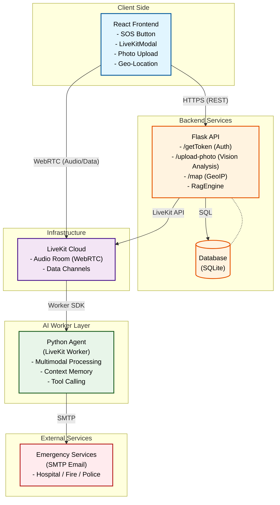
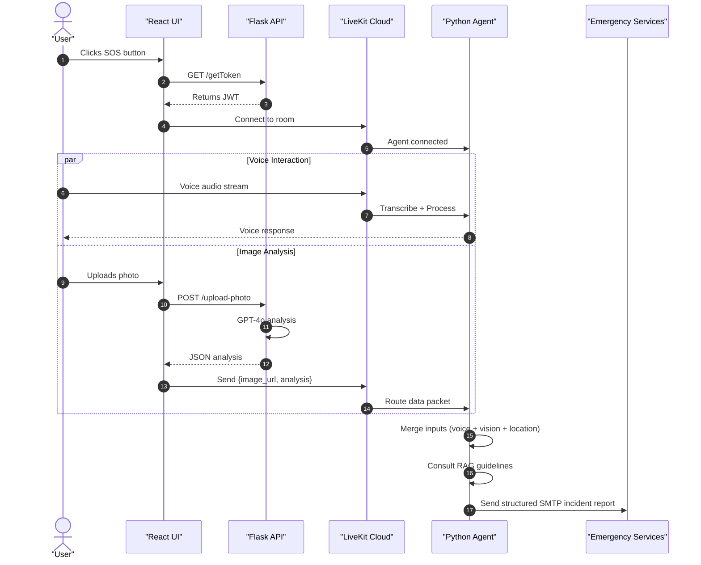

# 🆘 AI Emergency Response System (Multimodal)


> **A real-time, multimodal emergency assistance platform leveraging WebRTC, GPT-4o Vision, and autonomous AI agents to streamline incident reporting.**

## 📋 Project Overview

The **AI Emergency Response System** is a full-stack solution designed to bridge the gap between users in distress and emergency services. Unlike traditional SOS buttons, this system initiates a **real-time voice and video data session** with an AI Agent.

The agent listens to the user, analyzes uploaded images (e.g., injuries, fire, car accidents) using **GPT-4o Vision**, and autonomously drafts and dispatches structured incident reports via SMTP to the relevant authorities (Police, Hospital, Fire Dept) based on established guidelines.

### Key Features

* **Low-Latency Voice Interface:** powered by LiveKit and OpenAI (STT/TTS).
* **Computer Vision Analysis:** rapid assessment of scene photos via GPT-4o.
* **Geo-Location Tracking:** automatic IP-based or browser-based location tagging.
* **RAG-based Decision Making:** agent follows strict emergency guidelines stored in a vector store/knowledge base.
* **Automated Dispatch:** generates and sends emails to specific emergency branches without human intervention.

---

## 🏗️ System Architecture

### Component View (C4 – High Level)


### Sequence Diagram


## 🛠️ Tech Stack
* **Frontend (React 18):** Built with React + TailwindCSS for a responsive, mobile-first UI.
* **Real-Time Communication:** LiveKit client SDK for WebRTC audio + data channels.
* **State Management:** Lightweight React Context + Hooks architecture.

* **Backend API (Flask):** Python-based REST API handling auth, photo uploads, and geo-mapping.
* **Database Layer:** SQLite using SQLAlchemy for structured storage and report logging.
* **AI Integration:** OpenAI GPT-4o (Vision) for image analysis and incident understanding.

* **AI Worker (Agent):** LiveKit Agents Framework running autonomous multimodal reasoning.
* **LLM Core:** GPT-4o / GPT-4-Turbo for conversation, tool use, and decision logic.
* **Tooling:** Custom function calling for SMTP dispatch, RAG lookups, memory, and workflow control.

## 📁 Project Structure

```plaintext
/
├── backend/                   # Flask REST API
│   ├── server.py              # Application entry point
│   ├── db_driver.py           # SQLite interactions
│   ├── rag_engine.py          # Emergency guidelines logic
│   ├── map_service.py         # GeoIP & location resolution
│   └── requirements.txt
├── frontend/                  # React Application
│   ├── src/
│   │   ├── components/        # SOSButton, Map, Modal
│   │   └── hooks/             # useLiveKit, usePhotoUpload
│   └── package.json
├── agent/                     # LiveKit Worker
│   ├── agent.py               # Agent entry point & loop
│   ├── api.py                 # AssistantFnc (Email, Save)
│   └── prompt.py              # System / Tool prompts
└── README.md
```
## 🔐 Environment Variables

Each service (`backend/` and `agent/`) requires its own `.env` file placed in the root of the directory.

### Example `.env` File

```ini
LIVEKIT_API_KEY=your_key
LIVEKIT_API_SECRET=your_secret
LIVEKIT_URL=wss://your-project.livekit.cloud

OPENAI_API_KEY=sk-...

SMTP_SERVER=smtp.gmail.com
SMTP_PORT=587
SMTP_USER=alert@system.com
SMTP_PASS=your_app_password
```
## 🚀 Getting Started

### **Prerequisites**
Ensure you have the following installed:

- **Node.js v18+**
- **Python 3.10+**
- **LiveKit Cloud account** (or a local LiveKit instance)
- **OpenAI API Key**

---

## 1️⃣ Backend Setup

```bash
cd backend
python -m venv venv
source venv/bin/activate    # Windows: venv\Scripts\activate
pip install -r requirements.txt
flask run --port=5000
```

---

## 2️⃣ Agent Setup

```bash
cd agent
# Use a separate terminal for the agent
python -m venv venv
source venv/bin/activate    # Windows: venv\Scripts


